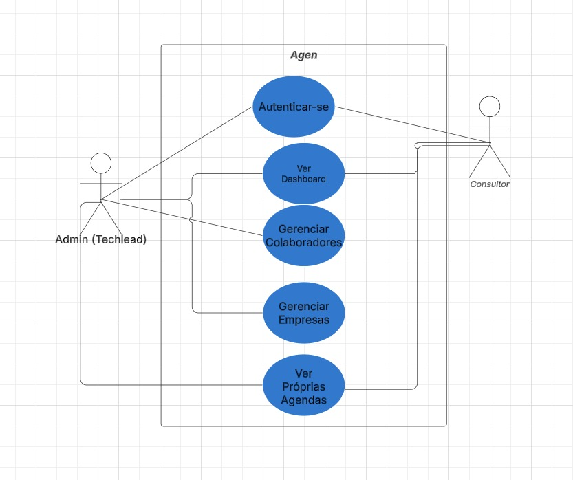
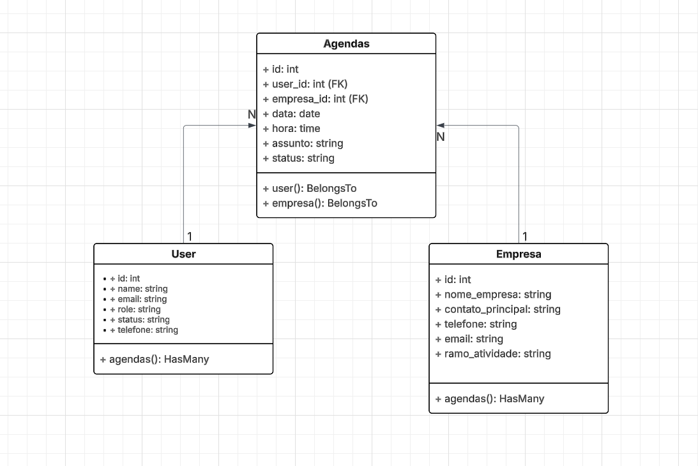
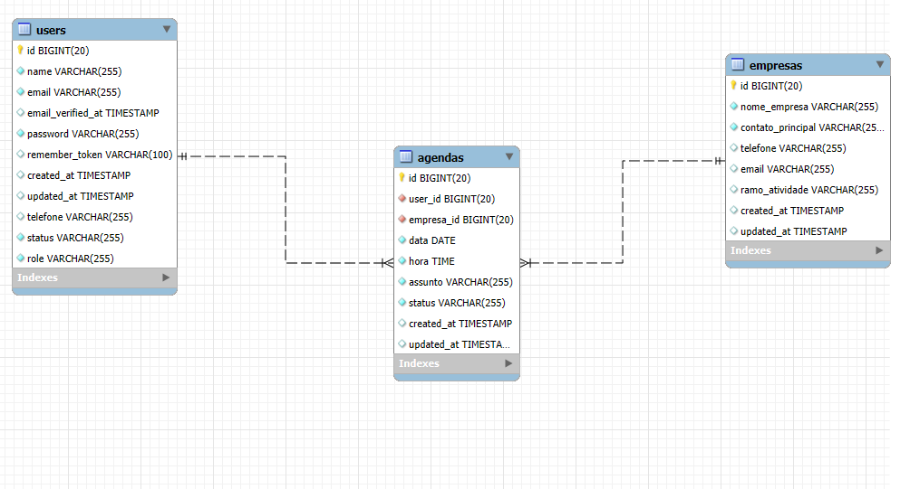
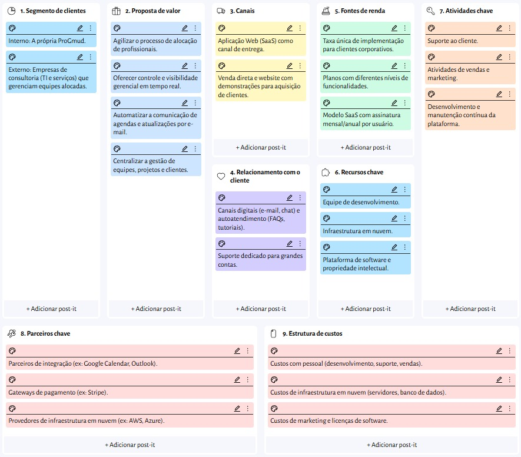

  
  <h1>AGENDA PROGMUD (AGEN) 🗓️</h1>
  
<strong>Aplicação Web para Agendamento de Consultores da ProGmud</strong>

  

    
    
  

---

## 📑 Sumário

- [🏛️ Sobre o Projeto](#-sobre-o-projeto)
- [🧭 Índice](#-índice)
- [📝 Resumo da Aplicação](#-resumo-da-aplicação)
  - [🎯 Objetivos](#-objetivos)
- [📋 Documento de Requisitos](#-documento-de-requisitos)
  - [✅ Requisitos Funcionais](#-requisitos-funcionais)
  - [🔧 Requisitos Não Funcionais](#-requisitos-não-funcionais)
- [🏛️ Arquitetura do Sistema (Laravel)](#-arquitetura-do-sistema-laravel)
  - [Diagrama de Casos de Uso](#diagrama-de-casos-de-uso)
  - [Diagrama de Classes](#diagrama-de-classes)
  - [Diagrama Entidade-Relacionamento (DER)](#diagrama-entidade-relacionamento-der)
- [💡 Estudo de Viabilidade](#-estudo-de-viabilidade)
- [📈 Regras de Negócio](#-regras-de-negócio)
- [🎨 Design](#-design)
- [📱 Protótipo](#-protótipo)
- [🛠️ Tecnologias Utilizadas](#-tecnologias-utilizadas)
- [👨‍💻 Autores](#-autores)
- [🏁 Considerações Finais](#-considerações-finais)
- [📚 Referências](#-referências)

---

## 🏛️ Sobre o Projeto

O **AGEN** é um sistema web criado para otimizar a experiência e a organização dos colaboradores da **ProGmud**.  
O objetivo principal é **automatizar o agendamento de consultores**, centralizar informações e facilitar a comunicação entre techleads e a equipe, substituindo processos manuais por uma plataforma digital eficiente e intuitiva.

---

## 🧭 Índice

1. Resumo da Aplicação  
2. Documento de Requisitos  
   - Funcionais  
   - Não Funcionais  
3. Arquitetura do Sistema (Laravel)
4. Estudo de Viabilidade  
5. Regras de Negócio  
6. Design  
7. Protótipo  
8. Aplicação  
9. Considerações Finais  
10. Referências  

---

## 📝 Resumo da Aplicação

### 🎯 Objetivos

**Objetivo Geral** Facilitar a transferência de informações entre consultores e techleads, com:  
- Criação automática de agendas  
- Envio individual por e-mail  
- Organização inteligente de horários  

**Objetivos Específicos** - Mapear processos atuais  
- Definir funcionalidades-chave  
- Propor arquitetura técnica  

---

## 📋 Documento de Requisitos

Os requisitos definem **o que o sistema deve fazer** (funcionais) e **como deve se comportar** (não funcionais), garantindo que o **AGEN** atenda às necessidades da ProGmud de forma eficiente, segura e acessível.

### ✅ Requisitos Funcionais (RF)

#### 🔹 Módulo de Cadastros e Gerenciamento (Core) 🗂️
- **RF01 – Cadastrar Consultores:** Permitir que Techleads cadastrem novos consultores.  
  **Dados:** `id_consultor (PK)`, `nome_completo`, `email_profissional`, `email_pessoal`, `cargo`, `especialidade_tecnica`, `status (Ativo/Inativo)`  

- **RF02 – Cadastrar Techleads:** Cadastro de Techleads com permissões elevadas.  
  **Dados:** `id_techlead (PK)`, `nome_completo`, `email_profissional`, `status (Ativo/Inativo)`  

- **RF03 – Cadastrar Clientes:** Cadastro dos clientes da ProGmud.  
  **Dados:** `id_cliente (PK)`, `razao_social`, `cnpj`, `nome_contato_principal`, `email_contato`  

- **RF04 – Gerenciar Projetos/Alocação:** Cadastro e gestão de períodos de alocação dos consultores.  
  **Dados:** `id_alocacao (PK)`, `id_consultor (FK)`, `id_cliente (FK)`, `data_inicio`, `data_fim`, `descricao_projeto`  

---

#### 🔹 Módulo de Agenda 📅
- **RF05 – Criar e Atribuir Agendas:** Criação, edição e visualização de agendas por Techleads, com prevenção de conflitos de horário.  
- **RF06 – Notificação Automática por E-mail:** Envio automático de e-mails após criação/alteração/exclusão de agendas.  
- **RF07 – Visualização de Agenda Pessoal:** Consultores só podem visualizar suas próprias agendas, sem editar.  

---

#### 🔹 Módulo de Autenticação e Perfis 🔐
- **RF08 – Autenticação de Usuários:** Tela de login com e-mail profissional + senha.  
- **RF09 – Níveis de Permissão:** - **Consultor:** acesso restrito à agenda própria e páginas informativas.  
  - **Techlead/Admin:** acesso total aos cadastros e gerenciamento de agendas.  

---

#### 🔹 Páginas Estáticas 📖
- **RF10 – Apresentação Institucional:** Páginas públicas com:  
  - Sobre a ProGmud (missão, visão, valores)  
  - Sobre o Sistema (objetivos e funcionalidades)  
  - Desenvolvedores (nome, foto, LinkedIn e GitHub)  

---

### 🔧 Requisitos Não Funcionais (RNF)

- **RNF01 – Usabilidade:** Interface simples, formulários claros e menus intuitivos.  
- **RNF02 – Desempenho:** Resposta em até **3 segundos** em condições normais de rede.  
- **RNF03 – Acessibilidade:** Seguir diretrizes da **WCAG**, com suporte a leitores de tela e navegação por teclado.  
- **RNF04 – Compatibilidade:** Responsivo e funcional em **Chrome, Firefox, Edge e Safari** (desktop e mobile).  
- **RNF05 – Segurança:** - Comunicação via **HTTPS** - Senhas com **hash** - Proteção contra **SQL Injection, XSS** e outras vulnerabilidades  

---

## 🏛️ Arquitetura do Sistema (Laravel)

Documentação da arquitetura MVC e do banco de dados desenvolvida para a versão Laravel da aplicação.

### Diagrama de Casos de Uso
O diagrama define os dois principais atores (Admin e Consultor) e suas permissões e ações exclusivas dentro do sistema, baseadas nos requisitos RF07 e RF09.

  
  
<em>Diagrama de Casos de Uso.</em>

### Diagrama de Classes
Este diagrama ilustra a arquitetura MVC (Model-View-Controller) do Laravel, focando nos Models e seus relacionamentos (operações).

  
  
<em>Diagrama de Classes (UML).</em>

### Diagrama Entidade-Relacionamento (DER)
Gerado via "Engenharia Reversa" do banco de dados MySQL, este diagrama mostra a estrutura exata das tabelas e as chaves estrangeiras que conectam `agendas` com `users` e `empresas`.

  
  
<em>Diagrama Entidade-Relacionamento (DER).</em>

---

## 💡 Estudo de Viabilidade

- **Infraestrutura**: Computador pessoal + internet da faculdade  
- **Tecnologias**: Ferramentas gratuitas (VSCode, Git, Figma, Balsamiq)  
- **Banco de dados**: SQLite / Firebase  
- **Hospedagem**: GitHub Pages  
- **Mão de obra**: Equipe interna (Luca & Aquiles)  

---

## 📈 Regras de Negócio

  
  
<em>Figura 1. Canvas do Modelo de Negócios.</em>

---

## 🎨 Design

**Paleta de Cores** 

  
  
<em>Figura 2. Paleta de Cores.</em>

**Tipografia** 

  
  
<em>Figura 3. Fonte Open Sans.</em>

**Logo** 

  
  
<em>Figura 4. Logo da aplicação AGEN.</em>

**Modelo de Navegação** 

  
  
<em>Figura 5. Modelo de Navegação.</em>

---

## 📱 Protótipo

🔗 [Acessar Protótipo Interativo no Balsamiq](https://balsamiq.cloud/sfh5gws/pqjpwco/r46FF)  

---

## 🛠️ Tecnologias Utilizadas

  
  
  
  
  
  
  

---

## 👨‍💻 Autores

  
Este projeto foi desenvolvido por:

  
  <table align="center">
    <tr>
      <td align="center">
        <a href="https://github.com/AquilesMorato">
          
           
          <b>Aquiles Augusto</b>
        </a>
      </td>
      <td align="center">
        <a href="https://github.com/Lucamorato2006">
          
           
          <b>Luca Morato</b>
        </a>
      </td>
    </tr>
  </table>

---

## 🏁 Considerações Finais

A criação do AGEN foi um exercício prático fundamental para aplicar metodologias de desenvolvimento de software aprendidas em sala.  
Os principais desafios (prazos curtos, equipe reduzida) foram superados com **flexibilidade, organização e divisão de tarefas**. A migração do front-end estático para um back-end MVC completo com Laravel foi o principal foco desta segunda etapa do projeto.

---

## 📚 Referências

- Matteson, Steve. *Open Sans Font*. [Google Fonts](https://fonts.google.com/specimen/Open+Sans)  
- [Balsamiq](https://balsamiq.com)  
- [GitHub](https://github.com)  
- [WeHandle](https://wehandle.com.br)  
- [Trello](https://trello.com)  
- [Figma](https://figma.com)